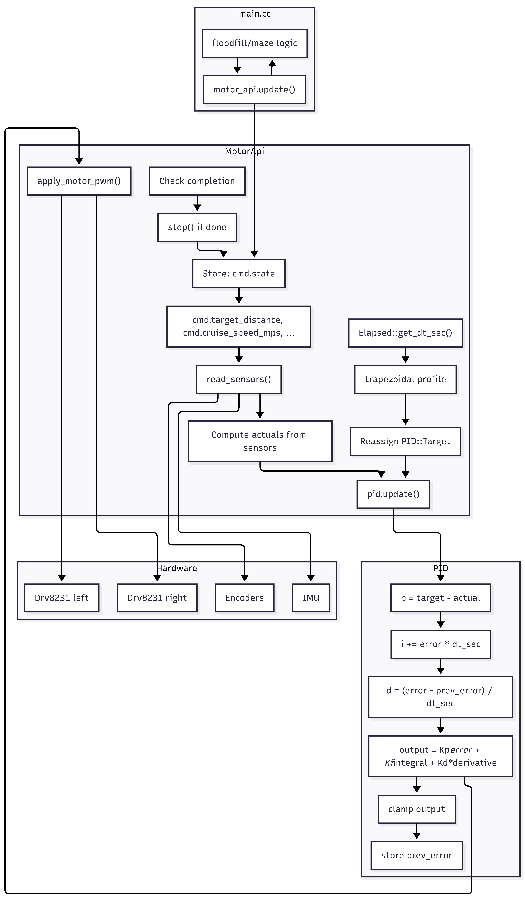

# PID Controller

## Overview

The PID controller in this project is used to control the left and right wheel speeds and the yaw (heading) of the micromouse robot. It receives feedback from both wheel encoders and an IMU (gyroscope), and outputs control signals to the motor driver.

### Inputs to the PID Controller

- **Encoder Data:**
	- `encoder.left_ticks`, `encoder.right_ticks`: The number of ticks from the left and right wheel encoders, used to calculate wheel velocities.
- **IMU Data:**
	- `imu`: Orientation data (quaternion) from the BNO055 IMU, used to compute the current yaw (heading) of the robot.

These inputs are packed into the `PID::Input` struct.

### Targets for the PID Controller

- **Target Wheel Speeds:**
	- `left_speed`, `right_speed`: Desired velocities for the left and right wheels (in m/s).
- **Target Yaw:**
	- `yaw`: Desired heading angle (in degrees).

These are provided in the `PID::Target` struct.

### PID Output

- **MotorOutput:**
	- `left`, `right`: Control signals for the left and right motors, which are converted to PWM duty cycles for the motor driver.

### Helpers and Internal Logic

- **ticks_to_velocity:** Converts encoder ticks to wheel velocities using wheel circumference and ticks per revolution.
- **quaternion_to_yaw:** Converts IMU quaternion data to a yaw angle in degrees.
- **limit_range, clamp_duty_cycle:** Helper functions to constrain output values within safe ranges.
- **Integral and Derivative State:** The controller maintains internal state for integral and derivative calculations for each wheel and yaw.
- **Elapsed:** Provides the time step (`dt`) between control loop updates. This is crucial for accurate integral and derivative calculations in the PID controller, especially when the control loop does not run at a fixed frequency. The `Elapsed::get_dt_sec()` function returns the elapsed time in seconds since the last call, allowing the PID to adapt to varying update rates.
- **Trapezoidal:** Generates dynamic velocity setpoints for smooth acceleration and deceleration using a trapezoidal velocity profile. The `Trapezoidal::trapezoidal()` function computes left and right wheel velocity setpoints based on the target distance, current encoder readings, and motion phase (acceleration, constant speed, deceleration). This ensures the robot accelerates and decelerates smoothly, improving motion accuracy and reducing mechanical stress.

### Block Diagram

Below is a block diagram of the micromouse PID control system, including the Trapezoidal Velocity Profile and Elapsed helpers:

### Use Case

The PID controller is used in a feedback loop to ensure the micromouse follows the desired speed and heading. It continuously reads sensor data, computes errors between the target and measured values, and adjusts motor outputs to minimize these errors. This enables precise control for tasks such as straight-line driving, turning, and following complex paths.